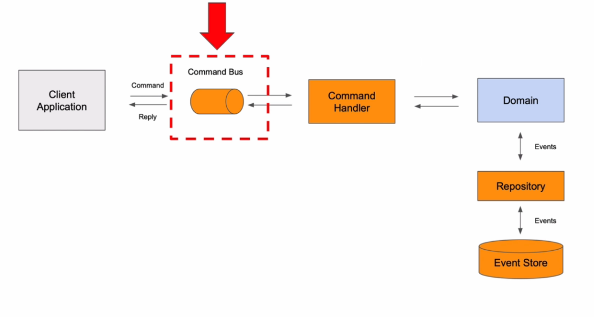
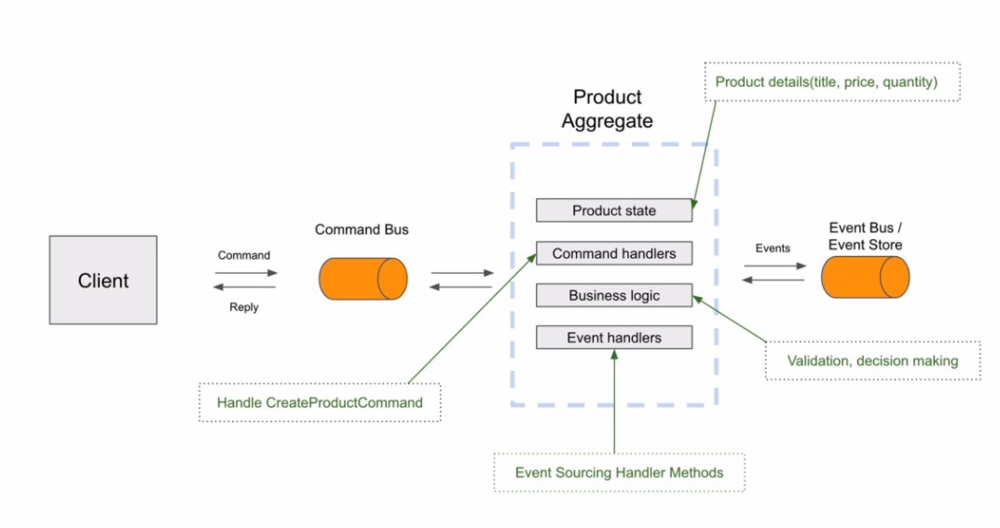
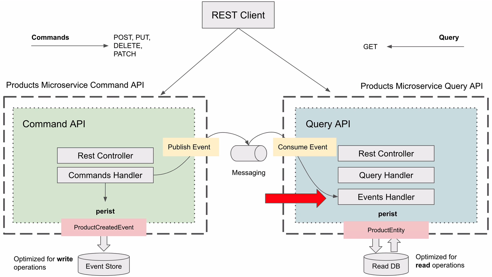
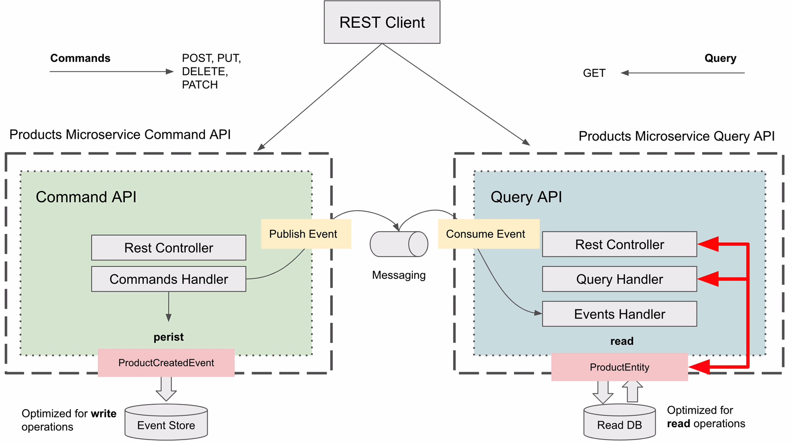
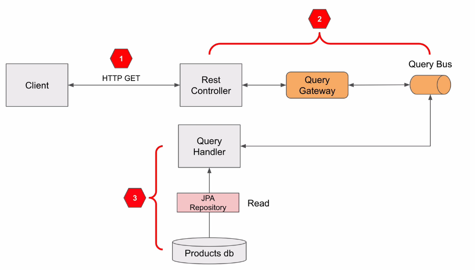
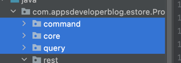

# 프로젝트 설명

<h2> Section7 : CQRS Pattern. Products Microservice </h2>

<h3> Command Class </h3>

- @RequestBody 로 전달받던 값을 Command 로 정의하였다.
- Command 는 \<Verb>\<Noun>Command 로 네이밍한다. 
  - ex) Create Product Command
- @TargetAggregateIdentifier annotation 을 추가한다.
  - 식별자를 구분짓기 위해..? (why..?)

<h3> Command Gateway </h3>
 

- Command Bus 로 command 가 전달되고, Command Bus 에서 이를 dispatch 한다.
  - CommandHandler 로 전달하거나 예외를 던지거나
- [CommandGateWay](./ProductsService/src/main/java/com/appsdeveloperblog/estore/ProductsService/command/rest/ProductsCommandController.java) bean 추가
  - send, sendAndWait 라는 비동기, 동기 호출 방법이 있다.
- 반환되는 값은 productId 이다.

<h3> Aggregate </h3>

1. 주요한 도메인 객체이며, 현재 상태를 유지한다.
   - 예제 그림에선 title, price, quantity 를 유지한다.
2. Command 를 handling 할 수 있는 method 도 포함할 수 있다.
   - ex) productCommand 가 dispatched 되면 aggregate class 의 method 가 될 수 있다.
3. Business logic 을 가질 수도 있다.
   - ex) ProductCommand 를 handling 할 때 validation 혹은 새로운 생성할지말지에 대한 결정을 할 수 있다.
4. Event sourcing handler method 를 가질 수도 있다.
   - Product 의 state 가 변경될 때마다 event sourcing method 가 호출(invoke)된다.
   - 예를들어 Product 상태를 업데이트하라는 Command 가 수신되면 가장먼저 Event Store 에서 aggregate 를 load 해야한다. 그리고 빈 객체를 만드는데, 이것이 빈 생성자가 필요한 이유이다. 

- [Aggregate class](./ProductsService/src/main/java/com/appsdeveloperblog/estore/ProductsService/command/ProductAggregate.java) 작성
  - @Aggregate, @AggregateIdentifier annotation 추가
  - 2개의 생성자가 필요하다.
    - default 생성자는 axon framework 에서 사용하므로 꼭 추가해야한다.
    - 두번째 생성자는 Command 가 dipatched 되면 사용되며, validation 작업도 진행한다.(+ @CommandHandler 추가)
  - Aggregate 에서 Command 가 성공적으로 처리되고, Event 를 게시하기위해 [Event](./ProductsService/src/main/java/com/appsdeveloperblog/estore/ProductsService/core/event/ProductCreatedEvent.java) 를 생성해야한다.

<h3> Event </h3>

- Event 는 \<Noun>\<PerformedAction>Event 형식으로 생성한다.
  - ex) Product Created Event
- Event 생성을 builder 로 할 수 있지만, <u>강사가 즐겨쓰는 방법</u>을 알려주기 위해 final keyword 를 제거한다.
  - Aggregate class 의 @CommandHandler 에서 validation 에 이상없으면 BeanUtil.copyProperties 로 command 를 Event 로 복사한다.
  - Builder 를 사용할 경우 속성이 많아질수록 사람의 실수가 있을 수 있다. 그래서 강사는 이 방법을 즐겨쓴다고 한다.
  - 그리고 BeanUtil 을 사용하면 없는 속성의 경우는 무시한다고 한다.
- Aggregate 는 단순히 Event 를 적용하거나 Event 를 apply 함수를 호출하여 aggregate lifecycle class 에 등록된다(?) 
  - Aggregate 의 상태가 update 되면(<u>update 되면이 뭐야..?</u>) 이 Event 는 Event Handler 중 하나에 publish 되도록 scheduling 된다.

<h3> Event Sourcing Handler </h3>

- Aggregate 에서 Event 를 등록했으므로 Event 가 전달되어야 한다.
- Aggreagte 의 state 를 update 하는데 사용되는 [Event Sourcing Handler](./ProductsService/src/main/java/com/appsdeveloperblog/estore/ProductsService/command/ProductAggregate.java) 를 Event Source 라고한다.
  - 위 링크의 on method 를 참조하자.
  - <b>Aggregate 의 현재상태를 최신상태로 initialize 하는데 사용된다.</b>
  - 상태 값들은 title, price, quentity 가 있으니 이를 추가하고 productId 는 @AggregateIdentifier annotation 을 추가한다.
    - Aggregate 의 @AggregateIdentifier 와 Command 의 @TargetAggregateIdentifier 는 서로 연관되어있음을 axon framework 에서 알고 dispatch 하고자 필요한 것(?) 같다.
  - @EventSourcingHandler 내부에는 business logic 이 들어가면 안된다.
    - 오로지 aggregate 의 상태를 update 하기위해 사용되어야한다.

<h4> 동작순서 중간정리 </h4>

- section 7 > 56. Trying how it works 에서 확인가능

- Controller 에서 Command 를 전달받고, 이를 CommandGateway 에 전달한다.
  - 이 행위가 CommandBus 에 Command 를 전달하는 것이다.
- @CommandHandler annotation 내부의 apply method 가 호출되면 Event 가 
- ProductCreated Event 가 dispatch 된다.
- @EventSourcingHandler 가 선언된 메소드 중 ProductCreated 를 argument 로 가진 handler 가 호출된다.
- Aggregate 의 state 가 update 된다.
- ProductCreatedEvent 가 다른 event handler 에 publish 되도록 스케쥴링 된다.
- 그리고 Event Store 에 persist 된다.

<h2> Section8 : CQRS. Persisting Event in the Products database. </h2>

- JPA 를 사용하여 DB(h2) 와 실제로 작업해볼거임
- spring-boot-starter-data-jpa, h2 추가
- h2 db [설정](./ProductsService/src/main/resources/application.properties)

<h3> Entity, Repository </h3>

- [ProductEntity](./ProductsService/src/main/java/com/appsdeveloperblog/estore/ProductsService/core/data/ProductEntity.java)
- [ProductRepository](./ProductsService/src/main/java/com/appsdeveloperblog/estore/ProductsService/core/data/ProductsRepository.java)

<h3> EventHandler Class </h3>

- 이벤트를 처리하는 클래스 이며, CQRS 에선 명백히 Query 에 속한다.
    - ProductAggregate Object 로 Product DB 에 영속화 한다.
    - [ProductEventHandler](./ProductsService/src/main/java/com/appsdeveloperblog/estore/ProductsService/core/event/ProductCreatedEvent.java)
    - axon framework 에선 ProductEventHandler 라 부르지만, 다른 프로젝트에선 <b>Projection</b> 이라 한다.
    - 그리고 ProductCreatedEvent 를 처리하도록 하려면 method 를 추가(on method)하고, <b>@EventHandler</b> 추가
    
<h3> 동작순서 중간정리 </h3>

- ApiGateway, DiscoveryService, ProductsService run
- spring.h2.console.settings.web-allow-others=true 로 변경하여 h2 console 보도록 설정
- http://localhost:8082/products-service/h2-console 로 이동 후 접속하여 DB 확인
  - JDBC url : jdbc:h2:file:/Users/mun/IdeaProjects/etc/udemy-cqrs-axon/h2/products;AUTO_SERVER=true
  - username : root
  - password : root

<h2> Section9 : CQRS. Querying Data </h2>

- Query Side
  - RestController -> Query Handler -> h2 DB 순서로 동작한다.
  - 먼저 Client 가 Http Request 를 요청하고, RestController 가 Query Bus 에 이를 전달하고 이전에 말한 것과 동일하게 동작한다.

- 기존에 ProductsCommandController (Create 를 위한) 가 있지만, Modify 를 위한 Controller 를 새로 생성할 것  [ProductsQueryController](./ProductsService/src/main/java/com/appsdeveloperblog/estore/ProductsService/query/rest/ProductsQueryController.java)
  - 즉, 하나는 Command API, 다른 하나는 Query API
  - 또한 필요 시 Command Microservice, Query Microservice 로 분리할 수도 있다.
  

 (69. Refactor Command API Rest Controller)
- 현재까지 command, core, query 3개의 패키지로 분리되어있다.
- 추후에 2개의 마이크로서비스로 분리한다면 command, query 패키지로 분리되고 core 는 서로 공유할 것이다.